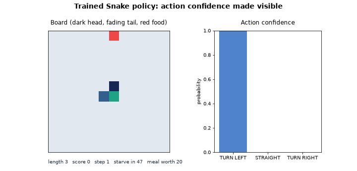
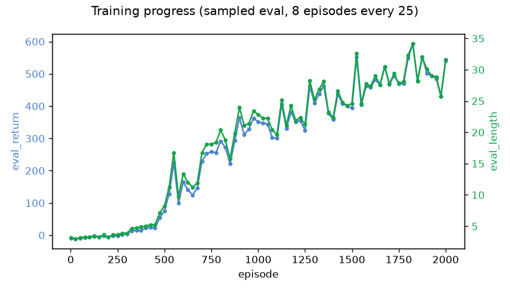

## The Snake That Taught Itself to Eat


Chirag found a Nokia 3310 in the lab closet and opened Snake on a whim. Three hours later he couldn't stop. There was something hypnotic about it—the tight timing, the impossible choices, the moment where instinct took over and your hands just knew. He kept playing.

Finally, at midnight, he set it down. His roommate was asleep. The lab was dark.

But his brain wouldn't shut up. How does anyone learn this? No lookahead planning—the screen's too small, the moves too fast. You're basically blind, making three choices every frame: left, straight, right. And somehow your body learns what works.

He opened his laptop and started typing.



Nobody wrote the strategy above. There is no rule in this repo that says *turn
away from the wall*, or *the food is that way*. There is a 12x12 board, a snake
that dies if it touches anything, and one number per step that says: **that was
better than average, or it was worse.** Everything in that clip it worked out
from that one number, played back a few thousand times.

Which raises the question the repo is really about. The snake above reaches
length 28. A hand-written rule a first-year could write in an afternoon — go
toward the food, unless that way is too tight — reaches **41**, and crashes a
fifth as often. The network is handed the exact same numbers that rule reads.
It reads them worse.

This repo is the environment and the baseline agent — a starting point, not a
finished thing. The actual challenge, the list of what's wrong with it, is not
in this file. It's on this repo's **Issues** tab. Go look.

## What's here

- `src/snake_rl/env.py` — the game: movement rules, the 18-value observation, the reward, scoring
- `src/snake_rl/models.py` — the policy: a small MLP with a categorical head
- `src/snake_rl/train.py` — the REINFORCE training loop
- `src/snake_rl/viewer.py` — a matplotlib board, live or saved as a GIF
- `src/snake_rl/benchmark.py` — re-measures every number in this file
- `tests/` — a few sanity checks on the game itself

That's deliberately the whole map. Everything else is faster to read than to
have explained here.

## How the thing actually works

Worth five minutes before you touch anything.

**The game.** A 12x12 grid. The snake starts with 3 segments, eats food to
grow, and dies by hitting a wall or its own body. It also dies if it goes
`4 * grid_size` steps without eating — the starvation clock.

**What it senses.** Eighteen numbers, and that is the entire observation:

| index | field |
|-------|-------|
| 0–2 | `danger` straight / right / left — is the next cell that way a wall or a body |
| 3–6 | one-hot heading |
| 7–10 | food up / down / left / right, in board coordinates |
| 11–13 | food forward, food right, food distance — the same food in the snake's own frame |
| 14–16 | `free_space` for each move — a flood fill from the cell that move leads into |
| 17 | `food_freshness` — how much of the starvation clock is left |

Worth noticing early, because the interesting issue is about them: slots 14–16
are the only thing that can see a trap. A snake of length L is dead the moment
it enters a pocket smaller than L, and the one-cell danger bits cannot tell
that apart from open board — the entrance looks identical. Those three
readings are also exactly what the winning hand-written rule reads, and the
network reads them worse.

**What it does.** Three actions, relative to where it is already pointing:
turn left, go straight, turn right. Not four compass directions — a quarter of
random moves would reverse it into its own neck, and exploration spent on
instant deaths teaches nothing.

**What it wants.** A meal pays `10 + up to 10 more` for taking a direct route:
the food was `d` cells away when it appeared, and reaching it in `d` steps pays
the full bonus, `2d` steps pays half. Not surviving costs `-10`, whether that
is a crash or the clock running out. Moving closer to the food is worth `+0.1`
and moving away `-0.1`, and every non-eating step costs a flat `0.01` so that
riding a safe loop is not free. The reward pays exactly what the scoreboard
pays, with no exceptions.

**The policy.** A two-layer MLP, 64 hidden units, tanh. It reads the eighteen
observations and outputs logits over the three actions; training samples from
that distribution, which is what lets it stumble into something better than it
already does.

**How it learns — REINFORCE.** The simplest policy gradient there is, and the
whole loop is about twenty lines in `train.py`:

1. Run one episode, remembering the log-probability of every action taken.
2. Add up the discounted reward from each step to the end — that step's
   *return*.
3. Normalise those returns across the episode, so the good half comes out
   positive and the bad half negative.
4. Nudge the network to make positive-return actions **more** likely and
   negative-return ones **less** likely.

No value network, no critic, no replay buffer. The gradient is noisy and the
thing learns slowly, which is honest: it is the algorithm every fancier method
is a fix for.

## The bar

Three seeds, 100 sampled episodes each. Reproduce with
`uv run py-eats-bench --rules --untrained`.

| policy | mean length | died |
|---|---|---|
| untrained | 3.15 | 92% |
| **trained (`py-eats-train`)** | **28.75** | 82% |
| greedy-food (hand-written) | 30.50 | 96% |
| food+safety (hand-written) | **41.12** | 15% |

Read the trained row against the hand-written rules, not against the untrained
floor. Against 3.15 anything looks like learning. The `died` column is the
whole story: `food+safety` is *slower* per meal than the trained policy and
still wins, because it simply never steps into a pocket too small to survive.

## Setup

This project uses [uv](https://docs.astral.sh/uv/) to manage the Python
environment — a single static binary, no system Python wrangling.

Install it (skip if you already have it):

```bash
curl -LsSf https://astral.sh/uv/install.sh | sh
```

Then, from the repo root:

```bash
uv sync
```

One command and you are set up. It creates the virtual environment, installs
the pinned versions from `uv.lock`, and installs the project — no `uv venv`,
no `activate`, no `pip install`. Everything below is prefixed with `uv run`,
which uses that environment automatically.

## Run it

Train a policy — no flags, about two and a half minutes on a laptop CPU:

```bash
uv run py-eats-train
```

Flags: `--episodes`, `--seed`, `--gamma`, `--horizon`, `--entropy-bonus`,
`--checkpoint`. Writes `trained_policy.pt` and `training_curve.png`. A run that
worked looks like this — the return climbing out of the hole over 2000
episodes:



Watch it (or watch it fail, which is also informative):

```bash
uv run py-eats-view                                   # hand-written demo heuristic
uv run py-eats-view --random                          # random moves
uv run py-eats-view --checkpoint trained_policy.pt    # the policy you just trained
uv run py-eats-view --save out.gif --seed 85          # render a GIF, headless-safe
```

The GIF at the top of this file is this repo's own checkpoint playing itself
out, seeded and saved by the viewer — `--seed 85` is the *median* episode of
120, not the best one a seed search could find.

## Submitting your work

Every issue is code: fork this repo, work on your fork, and open one pull
request back here with whatever you changed. One pull request can address any
number of the issues, and you do not need to attempt all of them.

> ### 📋 **[Read CONTRIBUTING.md before you open anything.](CONTRIBUTING.md)**
>
> Forking and branching, what you may and may not change, what to put in the
> pull request description, and what the automated checks do.

Two things worth knowing up front. The issues ask you to change the game, the
sensors and the training loop — that is the job, and you are expected to. But
it is easy to break the environment by accident: making it stop being
reproducible, letting a number run to infinity, or ending episodes that should
keep going. `uv run pytest` catches exactly that and says nothing about whether
you solved anything. Keep it green.

And the write-up is part of the answer. Several issues ask you to *measure*
something and *report the number*; nothing automated reads that, and a human
does. "It improved" is not a number.

## Going deeper

Two things worth reading, in this order:

- **[Deep Reinforcement Learning: Pong from Pixels](https://karpathy.github.io/2016/05/31/rl/)**
  — Andrej Karpathy. The clearest explanation of policy gradients anywhere.
  The section on REINFORCE is the algorithm in `train.py`, written out by
  hand. If you read one thing, read this.
- **[Spinning Up: Intro to Policy Optimization](https://spinningup.openai.com/en/latest/spinningup/rl_intro3.html)**
  — OpenAI. The same idea with the derivation filled in properly, and the
  reason that `log_prob × return` line in `train.py` is what it is.

lastly don't get overwhelmed if you don't know any of this stuff or the math associated with it. Our intention is for you to attempt it and get an intuitive idea about its mechanism, understanding will develop with time and effort.
ALL THE BEST
